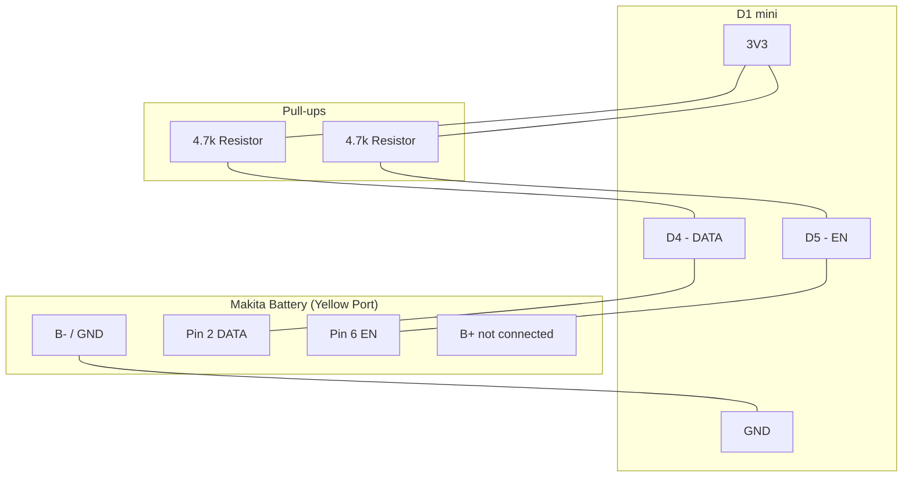

# Electrical Schematic - Makita OBI ESP8266

This document describes the connections needed to build the diagnostic hardware.

## Connection Diagram

## Connection List (Pinout)

| Source (ESP8266) | Destination | Notes |
| :--- | :--- | :--- |
| **GND** | **-** Battery Terminal | Common ground required. |
| **D4** | **DATA (OneWire)** | Bidirectional communication with the battery's BMS. |
| **D4** | **4.7k** resistor to **3.3V** | External pull-up, required for stability. |
| **D5** | Battery **EN** | Enable line, active high. |
| **D5** | **4.7k** resistor to **3.3V** | External pull-up for EN. |

## Bill of Materials (BOM)

1. **Microcontroller**: D1 mini or ESP8266 Mini.
2. **Resistors**:
    - 1x 4.7k DATA pull-up to 3.3V.
    - 1x 4.7k EN pull-up to 3.3V.
3. **Connector**: 3D printed adapter or spade terminals.
4. **Power Supply**: USB or 5V buck converter. Do not connect B+ directly.

> [!IMPORTANT]
> Make sure the ESP8266 ground (GND) is connected to the battery's negative terminal.

