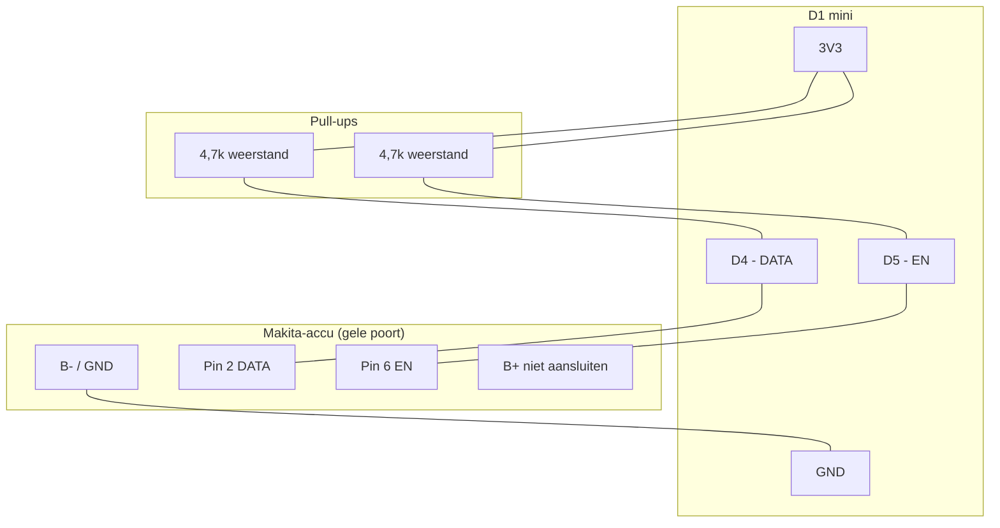

# Elektrisch schema - Makita OBI ESP8266

Dit document beschrijft de aansluitingen die nodig zijn om de diagnosehardware te bouwen.

## Aansluitschema

## Aansluitlijst (pinout)

| Bron (ESP8266) | Bestemming | Opmerkingen |
| :--- | :--- | :--- |
| **GND** | **-** accupool | Gemeenschappelijke massa is vereist. |
| **D4** | **DATA (OneWire)** | Bidirectionele communicatie met de BMS van de accu. |
| **D4** | **4,7k** weerstand naar **3,3V** | Externe pull-up, vereist voor stabiliteit. |
| **D5** | **EN** van de accu | Enable-lijn, actief hoog. |
| **D5** | **4,7k** weerstand naar **3,3V** | Externe pull-up voor de EN-lijn. |

## Onderdelenlijst (BOM)

1. **Microcontroller**: D1 mini of ESP8266 Mini.
2. **Weerstanden**:
    - 1x 4,7k voor de DATA pull-up naar 3,3V.
    - 1x 4,7k voor de EN pull-up naar 3,3V.
3. **Connector**: 3D-geprinte adapter of vlakstekkers.
4. **Voeding**: USB of een 5V buck-converter. Sluit B+ niet rechtstreeks aan.

> [!IMPORTANT]
> Zorg ervoor dat de massa (GND) van de ESP8266 is verbonden met de negatieve pool van de accu.

